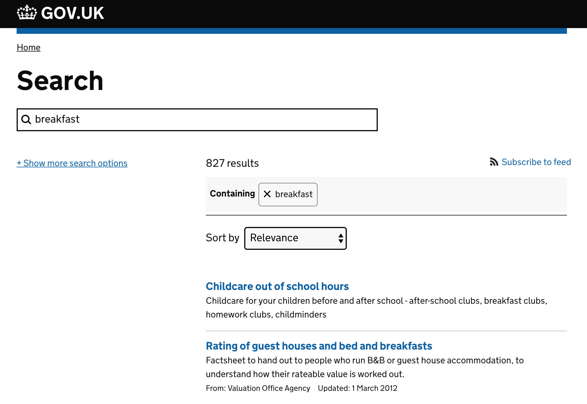
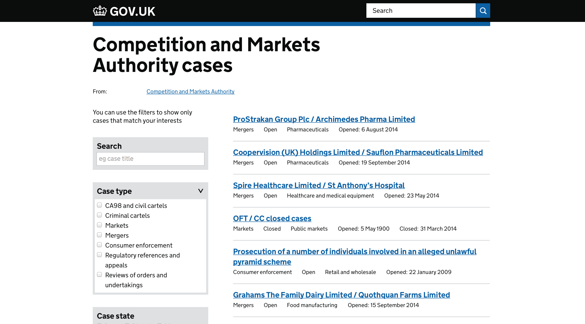

# Finder Frontend

Finder frontend renders search on GOV.UK.

## Live examples

### Site search
Site search is available from the header of every page.

[](https://www.gov.uk/search)

### Finder pages

Finder pages provide facetted searching over a collection of documents.

* [gov.uk/aaib-reports](https://www.gov.uk/aaib-reports)
* [gov.uk/cma-cases](https://www.gov.uk/cma-cases)
* [gov.uk/drug-safety-update](https://www.gov.uk/drug-safety-update)
* [gov.uk/drug-device-alerts](https://www.gov.uk/drug-device-alerts)
* [gov.uk/government/case-studies](https://www.gov.uk/government/case-studies)
* [gov.uk/government/groups](https://www.gov.uk/government/groups)
* [gov.uk/government/people](https://www.gov.uk/government/people)
* [gov.uk/world/organisations](https://www.gov.uk/world/organisations)
* [gov.uk/international-development-funding](https://www.gov.uk/international-development-funding)
* [gov.uk/maib-reports](https://www.gov.uk/maib-reports)
* [gov.uk/raib-reports](https://www.gov.uk/raib-reports)



## Nomenclature

* Finder: Page containing a list of filterable documents and filters.
* Facets: Metadata associated with documents.
* Filters: Searchable/filterable metadata for example `case_state={open|closed}` for a CMA case.

## Dependencies

* [alphagov/static](http://github.com/alphagov/static): provides static assets (JS/CSS) and provides the GOV.UK templates.
* [alphagov/content-store](http://github.com/alphagov/content-store): provides the content items for the finder itself -- containing the finder title, tagged organisations and related links
* [alphagov/rummager](http://github.com/alphagov/rummager): provides search results

## Running the application

```sh
$ ./startup.sh
```

If you are using the GDS development virtual machine then the application will be available on the host at [http://finder-frontend.dev.gov.uk/](http://finder-frontend.dev.gov.uk/)

## Running the test suite

Before you can run the test suite you'll need the [govuk-content-schemas]
repository locally. See
[`lib/govuk_content_schema_examples.rb`][content_schema_examples] for more
details.

The default `rake` task runs all the tests:

```sh
$ bundle exec rake
```

The application has jasmine tests, which can be accessed at `/specs` when the application is running in development mode. These are also run when `rake`, above, is run.

[govuk-content-schemas]: https://github.com/alphagov/govuk-content-schemas
[content_schema_examples]: https://github.com/alphagov/finder-frontend/blob/master/lib/govuk_content_schema_examples.rb

## Making a new finder

1. If required, add a schema to [alphagov/rummager](http://github.com/alphagov/rummager) describing your document type -- [example](https://github.com/alphagov/rummager/blob/master/config/schema/elasticsearch_types/cma_case.json)
2. Publish a Finder Content Item to the content store. See the doc for [Finder Content Item](https://github.com/alphagov/finder-frontend/blob/master/docs/finder-content-item.md) for more info.
3. Ensure your documents are indexed in [alphagov/rummager](http://github.com/alphagov/rummager) correctly.

### Developing a finder locally

You can run this application with a local file so you can develop a finder without having to publish the content item to the publishing-api.

For example:

```
DEVELOPMENT_FINDER_JSON=features/fixtures/aaib_reports_example.json ./startup.sh --live
```

### How to add a fixed filter?

You can use [gov.uk/api/search.json?filter_link=](https://www.gov.uk/api/search.json?filter_link=) with the path of the page you looking for to migrate.

For example, you want to filter by the field `link` on `/government/world/organisations`
You can access the following: https://www.gov.uk/api/search.json?filter_link=/government/world/organisations/british-antarctic-territory
You will be able to see inside results the field `format`

You can double check the filter by performing the following search using rummager:

http://rummager.dev.gov.uk/search.json?filter_NAME=VALUE

For more information please refer to the [search api documentation](https://alphagov.github.io/rummager/search-api.html).

## Application structure

* No data store -- all data comes via the APIs mentioned above.
* `app/models` contains two kinds of object.
  1. Value objects used to wrap up responses from API calls.
  2. Facet objects which wrap up the behaviour of different types of facet --
     eg radios, selects, etc.
* `app/presenters` contains objects which serialise the value objects to hashes
  for display via mustache.
* `app/parsers` contains objects which transform API responses into models.
