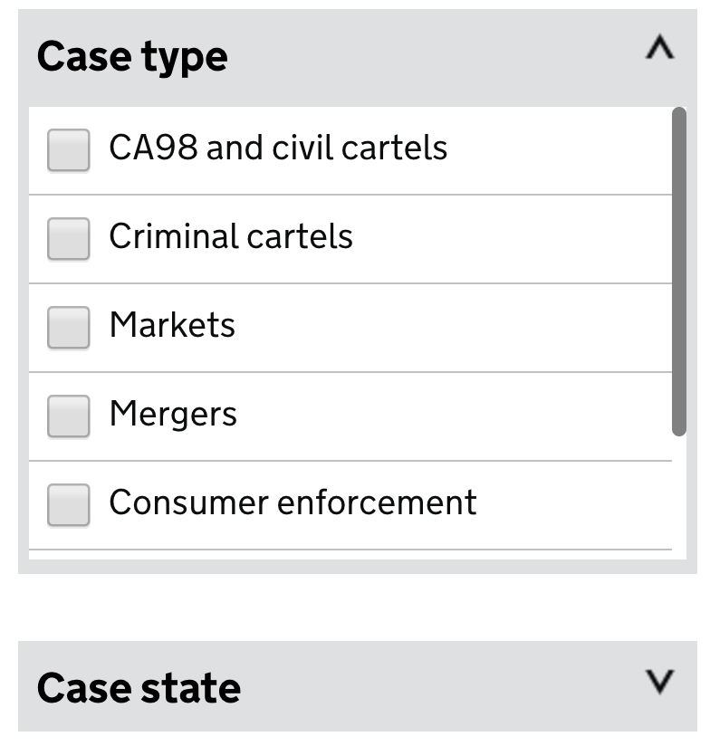

# The Finder Content Item Format

A Finder Content Item is a specialisation of the [Content Item](https://github.com/alphagov/content-store/blob/master/doc/content_item_fields.md) and is used by Finder Frontend to render the Finder page. This guide explains what goes into the ContentItem and why.

# `details`

## `alpha_message`

A string. Optional. Can be set to `null`.

Can contain HTML. If `phase` is `alpha`, `alpha_message` will be passed to the alpha banner.

## `beta_message`

A string. Optional. Can be set to `null`.

Can contain HTML. If `phase` is `beta`, `beta_message` will be passed to the beta banner.

## `document_noun`

A string. Required.

The lowercase singular version of whatever format the Finder is using. For example: [`/cma-cases`](https://www.gov.uk/cma-cases) has a `document_noun` of `case`, [`/aaib-report`](https://www.gov.uk/aaib-reports) has a `document_noun` of `report`. This is used to construct the sentence describing the current search by the user.

## `filter`

A hash. Optional.

Used to restrict the base search in Rummager. It can contain any key and value pair as long as the key is listed in `ALLOWED_FILTER_FIELDS` [in Rummager](https://github.com/alphagov/rummager/blob/be2ee6927eeab348c0bfc1e2b553c9c138a3ebc8/lib/search_parameter_parser.rb#L16).

For example filtering all documents with a `contact` format from HM Revenue & Customs would need a hash like:

```json
{
  "document_type": "contact",
  "organisations": [
    "hm-revenue-customs"
  ]
}
```

## `reject`

A hash. Optional.

Used to restrict the base search in Rummager. It can contain any key and value pair as long as the key is listed in `ALLOWED_FILTER_FIELDS` [in Rummager](https://github.com/alphagov/rummager/blob/be2ee6927eeab348c0bfc1e2b553c9c138a3ebc8/lib/search_parameter_parser.rb#L16). The `_MISSING` value is
useful here if you find yourself chaining too many values in filter and running over the max URL length supported by `Net::HTTP`.

For example, rejecting all documents which don't have a policy would need a hash like:

```json
{
  "policy": "_MISSING"
}
```

## `default_order`

A string. Optional.

You can use a minus (-) in front of the field to order in descending order (see [search-api/config/finders/case_studies_finder.yml](https://github.com/alphagov/search-api/blob/main/config/finders/case_studies_finder.yml#L21) for an example).

Rummager must allow this field to be sorted on. At the time of writing [this
was restricted to a couple of fields](https://github.com/alphagov/rummager/blob/ff35f2efb17d145f657cb520bc9892e64b713901/lib/parameter_parser/base_parameter_parser.rb#L10-L17).

**Note:** If you include a custom `sort` block in the finder configuration, you must also include `relevance` as one of the available sort options. Finder Frontend requires this option to be present in the DOM, and the page's JavaScript will fail to initialize if it's missing.

## `default_documents_per_page`

An integer. Optional.

Used to build pagination when querying Rummager.

## `signup_link`

A string. Optional.

If present in the links hash, the email alert signup link being displayed will point to `base_path/email-signup` where `base_path` is from the Finder object. `signup_link` allows you to point it at a different URL, [Drug Safety Update](https://www.gov.uk/drug-safety-update) and [Drug Device Alerts](https://www.gov.uk/drug-device-alerts) are the two which currently use this feature.

## `show_summaries`

A boolean. Required.

Used to decide if the summaries for Documents should be displayed in the results list. It will truncate the summary at the end of the first sentence.

## `summary`

A string. Optional.

Rendered in the header after the metadata. Can contain Govspeak and is rendered using the [Govspeak component](http://govuk-static.herokuapp.com/component-guide/govspeak).

## `facets`
An array of hashes. Optional.

Each facet corresponds to a document field that can take multiple values. Facets can be used to build user defined filters, and/or they can add metadata to search results.

### Example: a filterable `Case type` facet

```
{
  "key": "case_type",
  "name": "Case type",
  "type": "text",
  "display_as_result_metadata": true,
  "filterable": true,
  "allowed_values": [...],
  [...]
}
```


### Example: metadata for several facets


### Types of facet
The required keys for a facet hash depends on the
value of `type` in the hash. Valid values are `date`, `text` or `topical`.

#### Date Facets

When a date facet is filterable, it's rendered as a text field that accepts various forms of dates such as `2020` and `2020-01-02`.

When displayed as metadata, a date value takes the form `DD Month YYYY`.

```
{
  "key": "date_of_occurrence",
  "name": "Date of occurrence",
  "short_name": "Occurred",
  "type": "date",
  "preposition": "occurred",
  "display_as_result_metadata": true,
  "filterable": true
}
```
[https://www.gov.uk/aaib-reports]()

#### Text Facets

Text facets are used for faceting on a field that can take a number of different values. If filterable, a text facet is rendered as a group of checkboxes.

```
{
  "key": "case_state",
  "name": "Case state",
  "type": "text",
  "preposition": "which are",
  "display_as_result_metadata": true,
  "filterable": true,
  "allowed_values": [
    {
      "label": "Open",
      "value": "open"
    },
    {
      "label": "Closed",
      "value": "closed"
    }
  ]
}
```
[https://www.gov.uk/cma-cases]()

##### Predefined options using `allowed_values`

The `allowed_values` fields is an array of hashes defining fixed options for the facet. It's only used if `filterable` is set to `true` and `type` is set to `text`.

Each hash contains hashes with the following keys and values:

- `label`: A string. Required.

  Displayed as the label for the option in the `multi-select` Filter and as the label in the `sentence_fragment`.

- `value`: A string. Required.

  Appended to the URL when the option is selected. Usually a parameterised slug of the label, but it doesn't need to be a direct 1:1.

##### Dynamically generated options
If `allowed_values` is missing or empty, the values are dynamically generated based on the documents returned from the query.

This is usually better than providing fixed values, because the user is not given options that filter out every document in their search.

This behaviour is closer to what is meant by "facet" in the underlying  [search API](https://github.com/alphagov/rummager/blob/master/docs/search-api.md).

The current implementation of dynamic facets always requests the facet from the search api using a particular ordering: `1000,order:value.title`. This means it won't work for all fields.

```
{
  "key": "organisations",
  "short_name": "From",
  "type": "text",
  "display_as_result_metadata": true,
  "filterable": true,
  "preposition": "from",
  "name": "Organisation"
}
```
[https://www.gov.uk/government/policies]()

#### Topical Facets

A `topical` facet is used for faceting on something that changes state on a particular date. The motivating example is a `Topical Event`, which transitions from
`Current` to `Archived` on its `end_date`.

```
{
  "key": "end_date",
  "name": "Status",
  "type": "topical",
  "open_value": {
    "label": "Current",
    "value": "current"
  },
  "closed_value": {
    "label": "Archived",
    "value": "archived"
  },
  "preposition": "with status",
  "display_as_result_metadata": false,
  "filterable": true
}
```
[https://www.gov.uk/government/topical-events]()


##### The `open_value` and `closed_value` fields

These fields are hashes containing a `label` key and a `value` key. Required only when `type` is set to
`topical`.

These customise the `label` shown for both possible facet values and the corresponding `value` used in URLs.

`open_value` is the value that will be used when the `key` field is in the
future, and `closed_value` is the value that will be used when the `key` field
is in the past.

For example, if a content item has its `key` field set to `2020-07-01`, then it
will be considered `open` until midnight on the 1st July 2020, and `closed`
from then onwards. Documents might show up as `open` for slightly
longer than this due to page-level caching.

### Fields common across all facet types

#### `key`

A string. Required.

`snake_case` string which matches to the field being searched in Rummager.

#### `filterable`

A boolean. Required.

Specifies if the facet should have a matching Filter for the results.

#### `display_as_result_metadata`

A boolean. Required.

Specifies if the facet should be returned as metadata underneath each result.

#### `name`

A string. Required.

Used to label the filter panel for the facet.

For date facets, it may be used to label the metadata shown for each result. (See also short_name)

#### `preposition`

A string. Required if `filterable` is set to `true`.

Is prepended to the name of the Filter when constructing the `sentence_fragment` for that Filter.


#### `short_name`

A string. Optional.

For dates, the name of the Filter may be too long, such as `Date of occurrence`. The field lets you specify a short name. For the `Date of occurrence` example, the `short_name` would be `Occurred`.

# `routes`

In order for a Finder to work as intended, the routes array needs to have 3 entries. One for the page, one for `.json` which is used to update the results and one for `.atom` which is used for the Atom feed. Example:

```json
[
  {
    "path": "/a-finder-base-path",
    "type": "exact",
  },
  {
    "path": "/a-finder-base-path.json",
    "type": "exact",
  },
  {
    "path": "/a-finder-base-path.atom",
    "type": "exact",
  }
]
```


# `links`

## `organisations`

Currently, only the first Organisation is displayed as metadata on the Finder.

## `email_alert_signup`

This is the Content Item for the email-signup for the Finder. Most of these live at `#{base_path}/email-signup` but there's no reason this couldn't point anywhere else.
