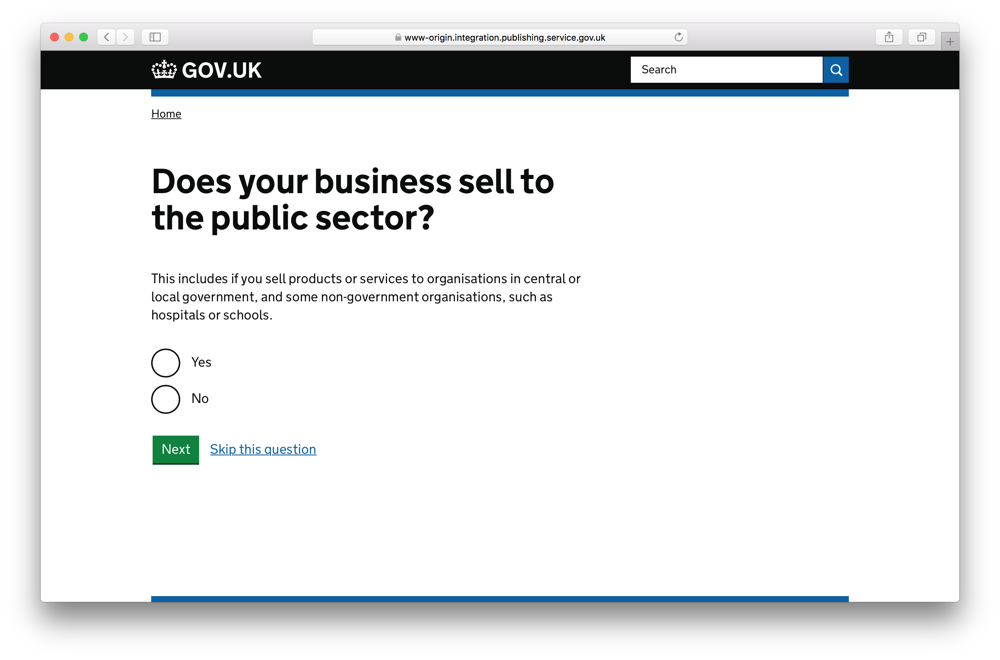

# Q&A frontend

The Q&A frontend is a finder-frontend feature that walks users through the facets for a given finder with one facet per page.

Any, all or no filters can be selected for each facet, and any question may be skipped. At the end of the process, the user is directed to the given finder with their selections intact.

At the time of writing, this feature has been defined for one finder and relies on a [YAML file](../lib/prepare_business_uk_leaving_eu.yaml). This file defines things like the base path of the Q&A and the underlying finder, as well as questions, question types and descriptions for each question page.

The YAML file and finder content item together provide all the data required for the Q&A frontend.

The name of the YAML file to use is defined based on the base path of the Q&A. Therefore, multiple Q&As can be created by defining multiple YAML files.
